# Задачи для автомата по программированию

### Сделал: Карпов Роман, ИВТ-2

### **Все задачи были сделаны только мной, без использования каких-либо нейросетей и т.п.**

## [Задача 1](./task01/main.c)

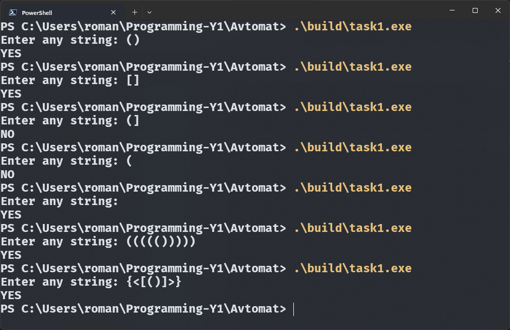

## [Задача 2](./task02/main.c)

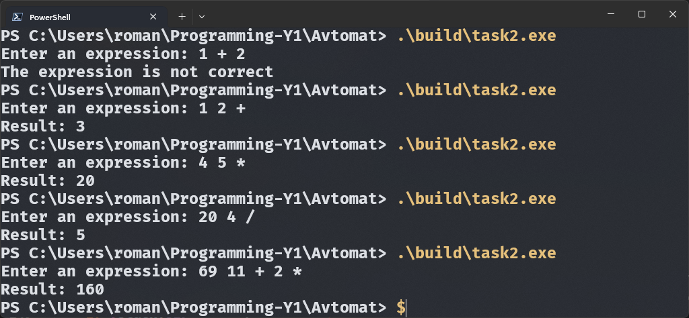

## [Задача 3](./task03/main.c)

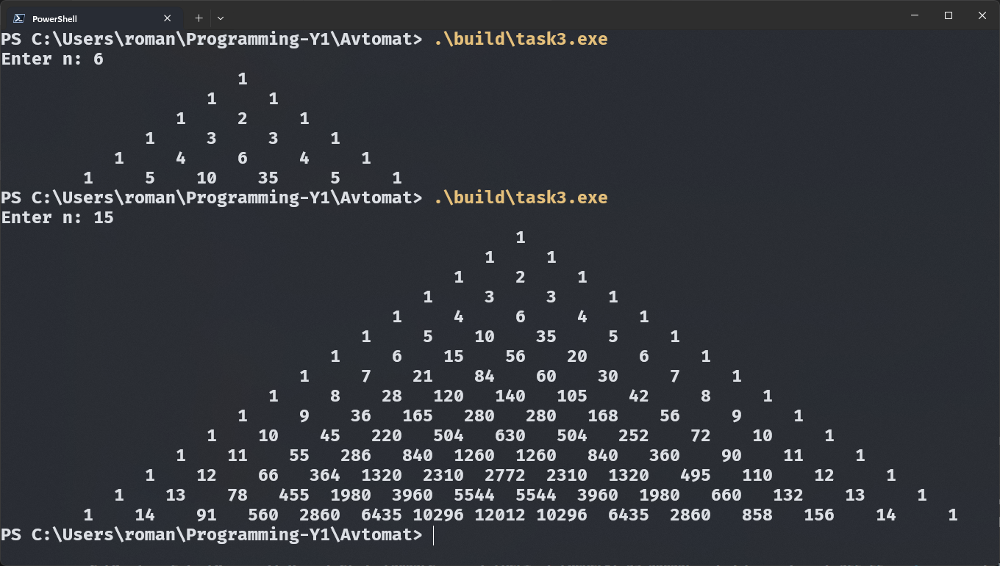

## [Задача 4](./task04/main.c)

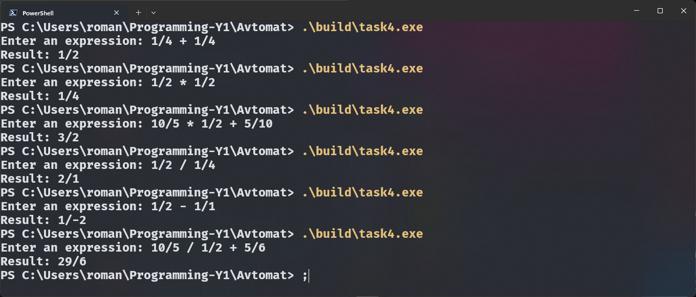

## [Задача 5](./task05/main.c)

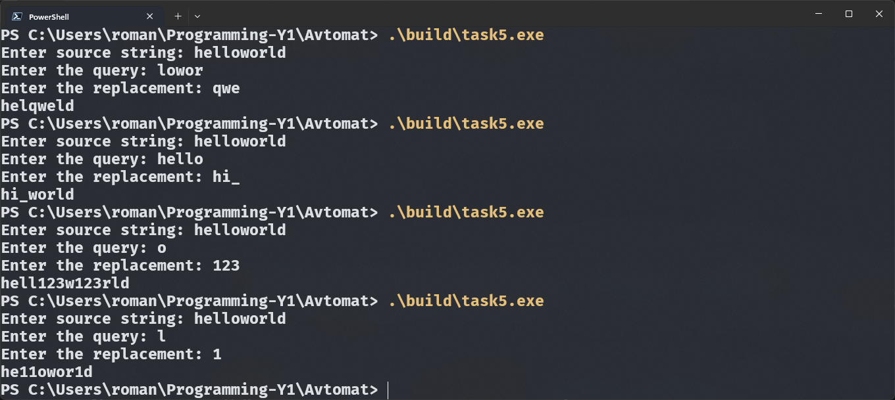

## [Задача 6](./task06/main.c)

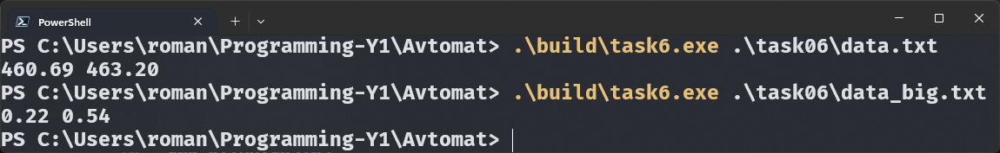

## [Задача 7](./task07/main.c)

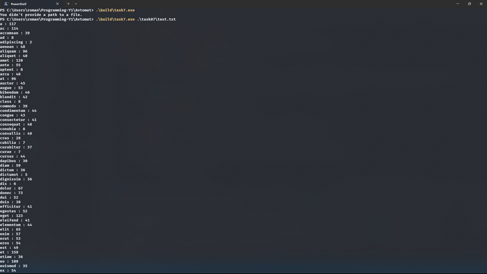

## [Задача 8](./task08/main.c)

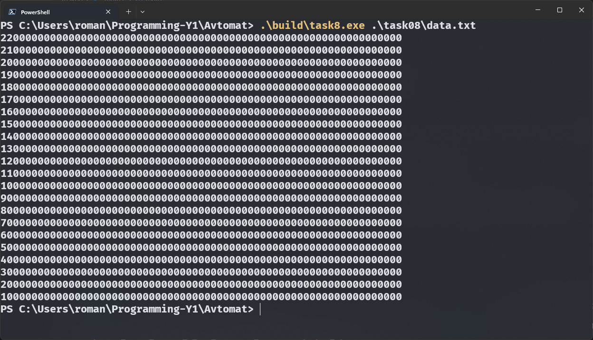

## [Задача 9](./task09/main.c)

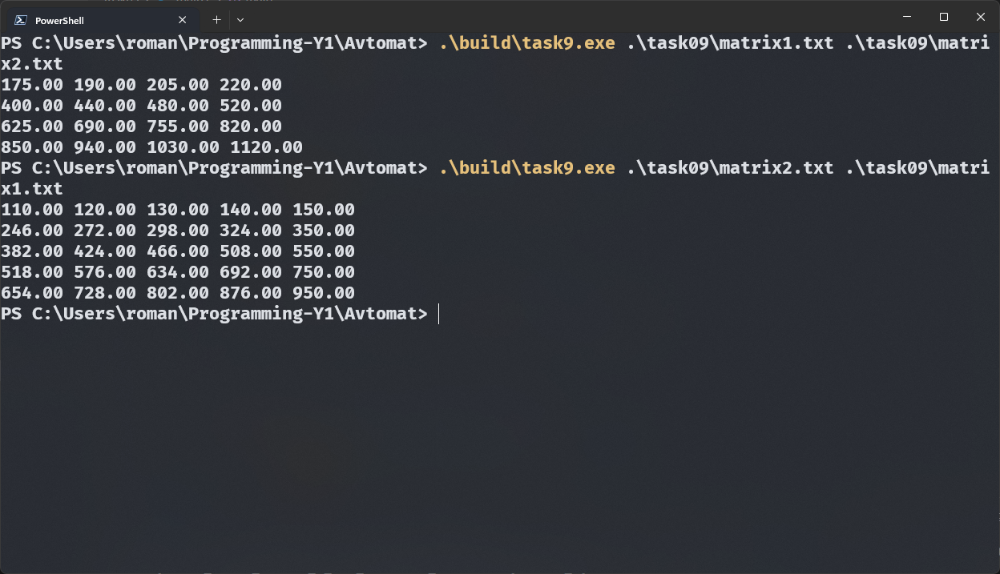

## [Задача 10](./task10/main.c)

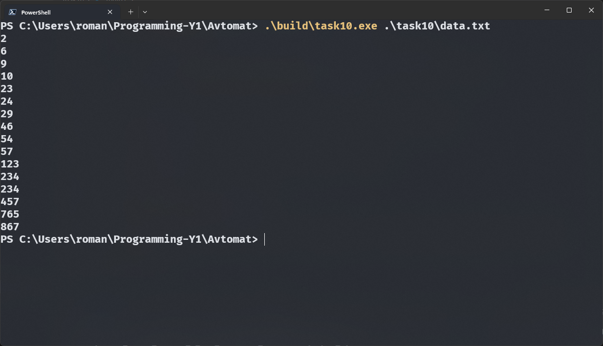

## [Задача 11](./task11/main.c)

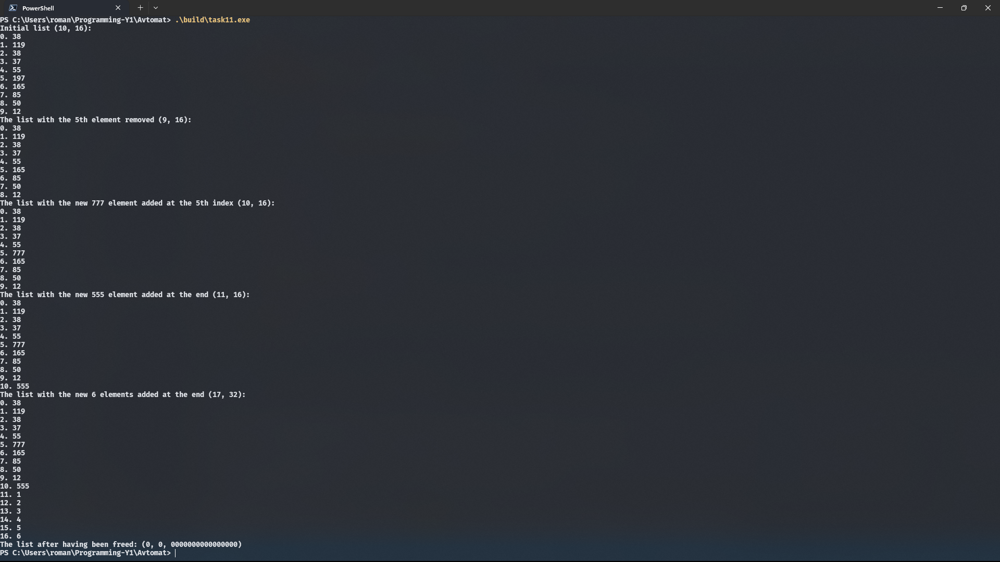

## [Задача 12](./task12/main.c)

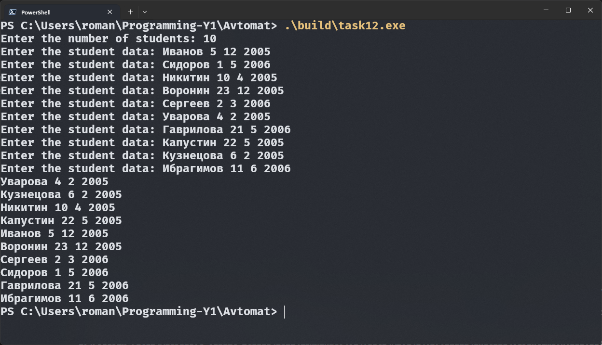

## [Задача 13](./task13/main.c)

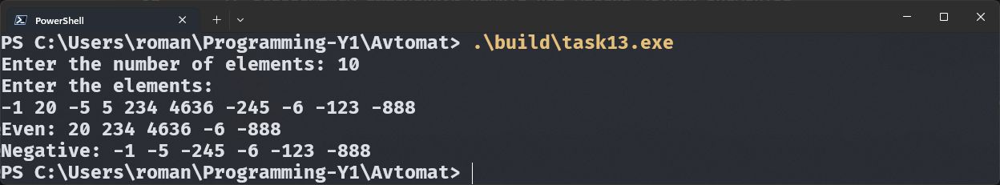

## [Задача 14](./task14/main.c)

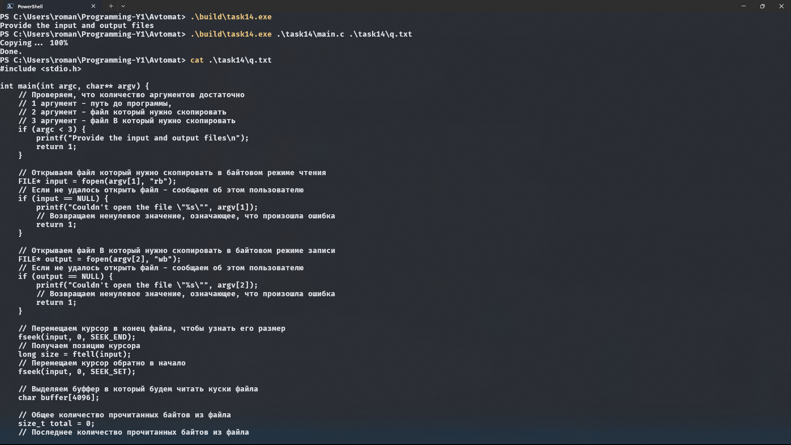

## [Задача 15](./task15/main.c)

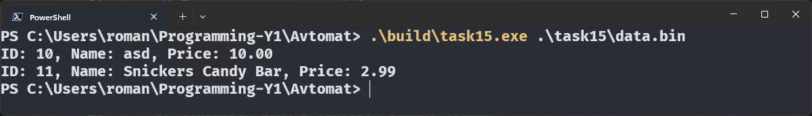

## [Задача 16](./task16/main.c)

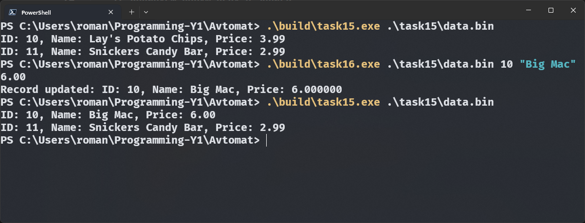

## [Задача 17](./task17/main.c)

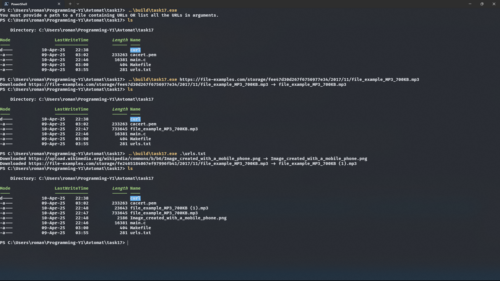

## [Задача 18](./task01/main.c)

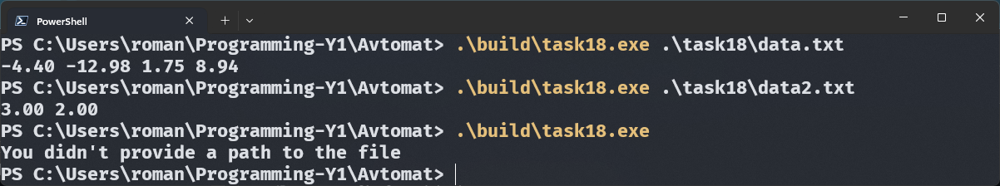

<!-- ## [Задача 19](./task01/main.c) -->

## [Задача 20](./task20/main.c)

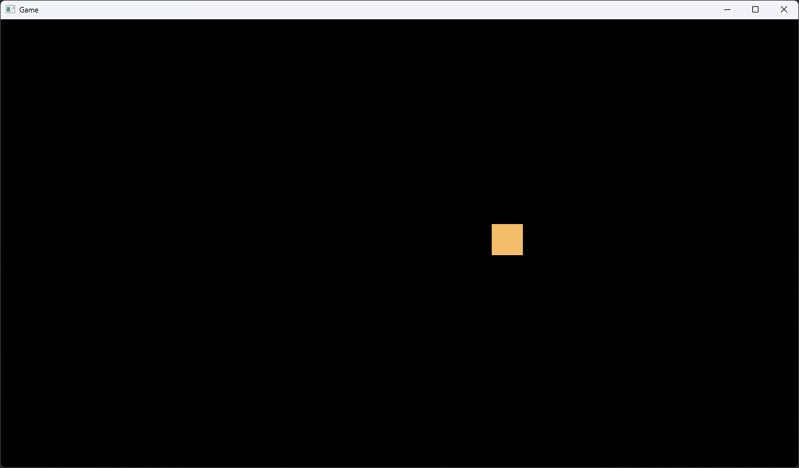
