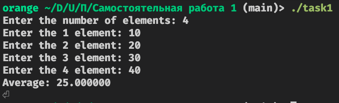
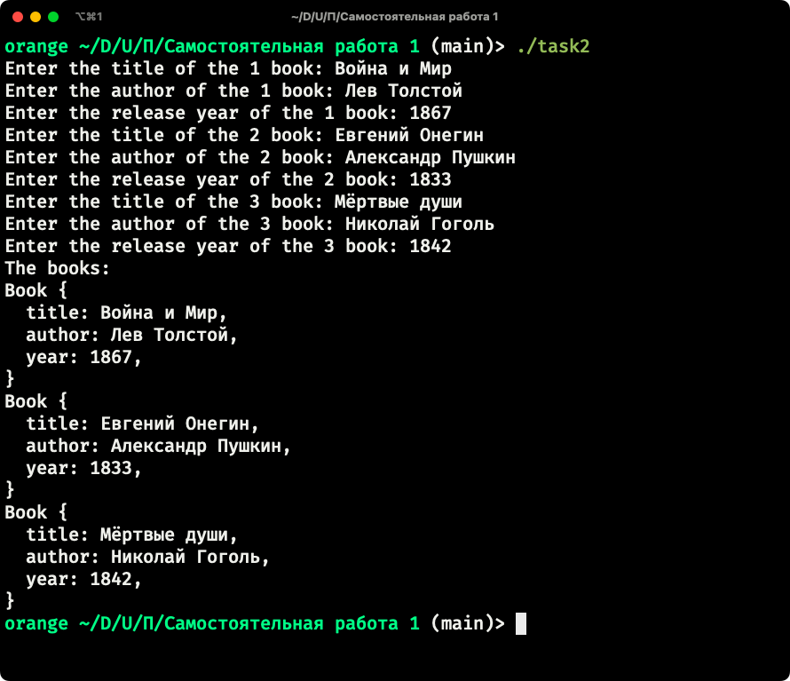
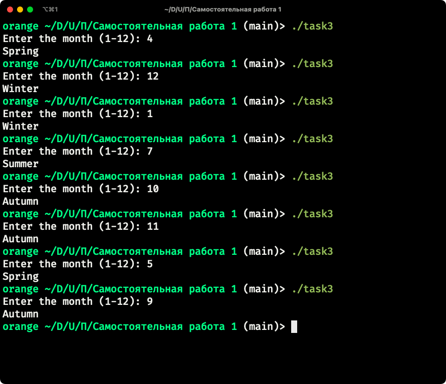

# Самостоятельная работа 1

### Тема: 

### Сделал: Карпов Роман, ИВТ-2

## Задание 1

### Постановка задачи

Напишите программу на языке Си, которая:

* Запрашивает у пользователя количество элементов массива (целое число N). • Динамически выделяет память для массива из N элементов типа float.
* Заполняет массив значениями, введёнными с клавиатуры.
* Вычисляет и выводит среднее арифметическое всех элементов массива.
* При обращении к элементам массива используйте арифметику указателей (без оператора []).
* Освобождает выделенную память в конце работы программы.

### Математическая модель

Отсутствует

### Список идентификаторов

| Имя | Тип | Смысл |
| -   | -   | -     |
| n | size_t | Количество элементов в массиве |
| array | float* | Указатель на выделенный массив |
| i | size_t | Индекс элемента в массиве |
| sum | float | Сумма элементов в массиве |
| average | float | Среднее арифметичское элементов массива | 

### Код программы 

```c
#include <stdio.h>
#include <stdlib.h>

int main() {
    size_t n;
    printf("Enter the number of elements: ");
    scanf("%zu", &n);

    float* array = (float*) malloc(n * sizeof(float));

    for (size_t i = 0; i < n; ++i) {
        printf("Enter the %zu element: ", i + 1);
        scanf("%f", array + i * sizeof(float));
    }

    float sum = 0;
    for (size_t i = 0; i < n; ++i) {
        sum += *(array + i * sizeof(float));
    }

    float average = sum / n;

    printf("Average: %f\n", average);

    free(array);

    return 0;
}
```

### Результаты выполненной работы



## Задание 2

### Постановка задачи

Создайте структуру Book, которая содержит следующие поля:

* title – массив символов (строка) для хранения названия книги (максимум 50 символов); • author – массив символов для хранения имени автора (максимум 50 символов);
* year – целое число, обозначающее год издания книги.
Напишите программу, которая:
* Создаёт массив из 3-х экземпляров структуры Book.
* Запрашивает у пользователя данные для каждой книги (название, автора и год издания).
* Выводит информацию обо всех книгах на экран,используя для этого отдельную функцию printBook(), которая принимает указатель на структуру Book.

### Математическая модель

Отсутствует

### Список идентификаторов

| Имя | Тип | Смысл |
| -   | -   | - |
| books | Book* | Указатель на выделенный массив для книг |
| i | size_t | Индекс элемента в массиве |

### Код программы 

```c
#include <stdio.h>
#include <stdlib.h>
#include <string.h>

#define BOOK_COUNT 3

typedef struct {
    char title[50];
    char author[50];
    unsigned int year;
} Book;

static void printBook(const Book* book) {
    printf("Book {\n");
    printf("  title: %s,\n", book->title);
    printf("  author: %s,\n", book->author);
    printf("  year: %u,\n", book->year);
    printf("}\n");
}

int main() {
    Book* books = (Book*) malloc(BOOK_COUNT * sizeof(Book));

    for (size_t i = 0; i < BOOK_COUNT; ++i) {
        printf("Enter the title of the %zu book: ", i + 1);
        fgets(books[i].title, sizeof(books[i].title), stdin);
        books[i].title[strcspn(books[i].title, "\r\n")] = 0;

        printf("Enter the author of the %zu book: ", i + 1);
        fgets(books[i].author, sizeof(books[i].author), stdin);
        books[i].author[strcspn(books[i].author, "\r\n")] = 0;

        printf("Enter the release year of the %zu book: ", i + 1);
        scanf("%u", &books[i].year);
        
        fflush(stdin);
    }

    printf("The books:\n");
    for (size_t i = 0; i < BOOK_COUNT; ++i) {
        printBook(&books[i]);
    }
    
    free(books);
}
```

### Результаты выполненной работы



## Задание 3

### Постановка задачи

Создайте перечисление Season со следующими значениями:

* WINTER, SPRING, SUMMER, AUTUMN

Напишите программу, которая:

* Запрашивает у пользователя номер месяца (целое число от 1 до 12).
* На основе введённого номера месяца определяет и выводит соответствующий сезон:
  * Зима: декабрь (12), январь (1) и февраль (2);
  * Весна: март (3), апрель (4) и май (5);
  * Лето: июнь (6), июль (7) и август (8);
  * Осень: сентябрь (9), октябрь (10) и ноябрь (11).
* Для определения сезона можно использовать условные операторы (if-else) или конструкцию switch.

### Математическая модель

Отсутствует

### Список идентификаторов

| Имя | Тип | Смысл |
| - | - | - |
| month | unsigned int | Номер месяца |

### Код программы

```c
#include <stdio.h>

enum Season {
    WINTER,
    SPRING,
    SUMMER,
    AUTUMN
};

int main() {
    unsigned char month;
    printf("Enter the month (1-12): ");
    scanf("%hhu", &month);

    if (month == 12 || month <= 2) {
        printf("Winter\n");
    } else if (month >= 3 && month <= 5) {
        printf("Spring\n");
    } else if (month >= 6 && month <= 8) {
        printf("Summer\n");
    } else if (month >= 9 && month <= 11) {
        printf("Autumn\n");
    }

    return 0;
}
```

### Результаты выполненной работы


