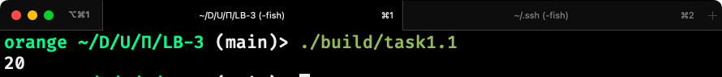
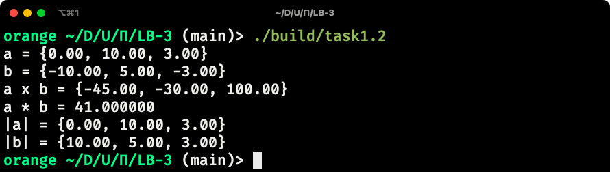
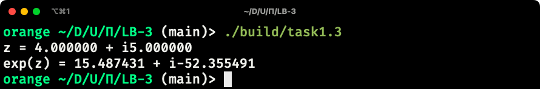
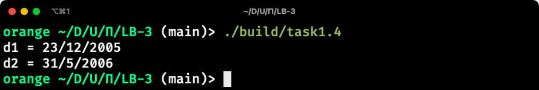
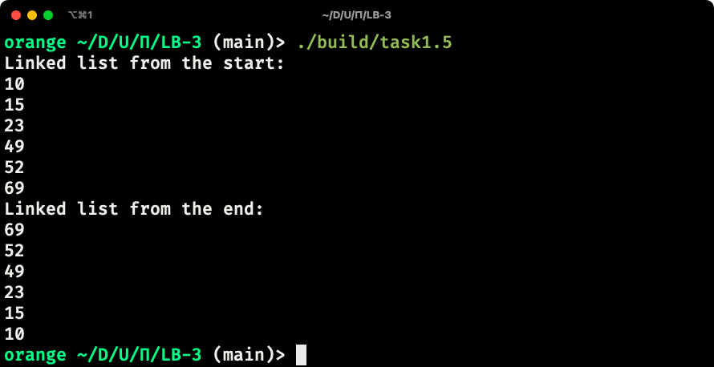
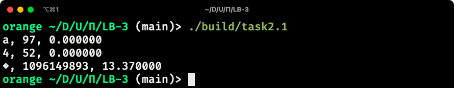
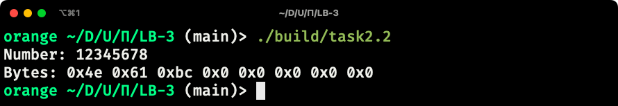
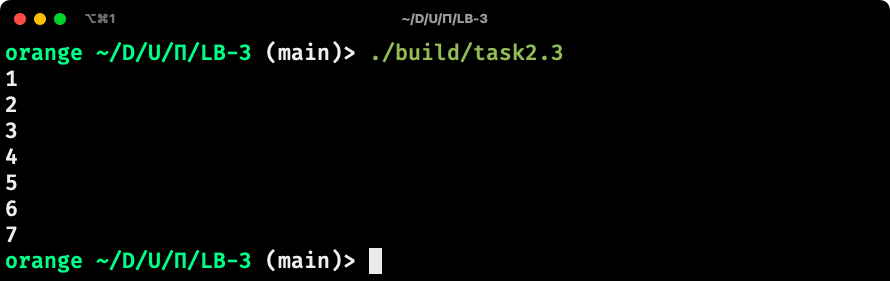
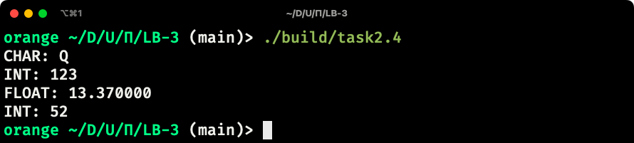

# Лабораторная работа 3

### Сделал: Карпов Роман, ИВТ-2

### Тема: Структуры. Объединения. Перечисления

## Задание 1.1

### Постановка задачи

Создать некоторую структуру с указателем на некоторую функцию в качестве поля. Вызвать эту функцию через имя переменной этой структуры и поле указателя на функцию.

### Математическая модель

Отсутствует

### Список идентификаторов

| Имя | Тип | Смысл |
| -   | -   | -     |
| f | Function | Структура с указателем на функцию |
| result | int | Результат выполнения функция |
 
### Код программы

```c
#include <stdio.h>

typedef struct {
    int (*ptr)(int, int);
} Function;

int add(int a, int b) {
    return a + b;
}

int main() {
    Function f = {
        .ptr = add
    };

    int result = f.ptr(10, 10);

    printf("%d\n", result);

    return 0;
}
```

### Результаты выполенной работы



## Задание 1.2

### Постановка задачи

Создать структуру для вектора в 3-х мерном пространстве. Реализовать и использховать в своей программе следующие операции над векторами:

* скалярное умножение векторов; • векторное произведение;
* модуль вектора;
* распечатка вектора в консоли.

В структуре вектора указать имя вектора в качестве отдельного поля
этой структуры.

### Математическая модель

Отсутствует

### Список идентификаторов

| Имя | Тип | Смысл |
| -   | -   | -     |
| a   | Vector | Вектор a |
| b   | Vector | Вектор b |
| cross | Vector | Результат произведения векторов a и b |
| dot | float | Результат скалярного произведения векторов a и b|
| a_abs | Vector | Модуль вектора a |
| b_abs | Vector | Модуль вектора b |

### Код программы

```c
#include <stdio.h>
#include <math.h>

typedef struct {
    float x, y, z;
    char* name;
} Vector;

Vector vector_mul(Vector a, Vector b) {
    return (Vector) {
        .x = a.x * b.x,
        .y = a.y * b.y,
        .z = a.z * b.z
    };
};

float vector_dot(Vector a, Vector b) {
    return a.x * b.x + a.y * b.y + a.z * b.z;
};

// https://en.wikipedia.org/wiki/Cross_product#Coordinate_notation
Vector vector_cross(Vector a, Vector b) {
    return (Vector) {
        .x = a.y * b.z - b.y * a.z,
        .y = a.z * b.x - b.z * a.x,
        .z = a.x * b.y - b.x * a.y,
        .name = NULL
    };
};

Vector vector_abs(Vector v) {
    return (Vector) {
        .x = fabsf(v.x),
        .y = fabsf(v.y),
        .z = fabsf(v.z),
        .name = NULL
    };
}

void vector_print(Vector v) {
    printf("{%.2f, %.2f, %.2f}\n", v.x, v.y, v.z);
}

int main() {
    Vector a = {
        .x = 0,
        .y = 10,
        .z = 3,
        .name = "a"
    };
    
    Vector b = {
        .x = -10,
        .y = 5,
        .z = -3,
        .name = "b"
    };

    Vector cross = vector_cross(a, b);
    float dot = vector_dot(a, b);
    Vector a_abs = vector_abs(a);
    Vector b_abs = vector_abs(b);

    printf("a = ");
    vector_print(a);

    printf("b = ");
    vector_print(b);

    printf("a x b = ");
    vector_print(cross);

    printf("a * b = %f\n", dot);

    printf("|a| = ");
    vector_print(a_abs);

    printf("|b| = ");
    vector_print(b_abs);

    return 0;
}
```

### Результаты выполенной работы



## Задание 1.3

### Постановка задачи

Вычислить, используя структуру комплексного числа, комплексную
экспоненту exp(z) некоторого z ∈ C:

$$ exp(z) = 1 + z + \frac{1}{2!} z^2 + \frac{1}{3} z^3 + ... + \frac{1}{n!} z^n $$

### Математическая модель

Отсутствует

### Список идентификаторов

| Имя | Тип | Смысл |
| -   | -   | -     |
| z | double complex | Комплексное число z |
| result | double complex | Результат вычисления экспоненты от комплексного числа z |

### Код программы

```c
#include <stdio.h>
#include <complex.h>

int main() {
    double complex z = 4 + 5*I;
    double complex result = cexp(z);

    printf("z = %f + i%f\n", creal(z), cimag(z));
    printf("exp(z) = %f + i%f\n", creal(result), cimag(result));

    return 0;
}
```

### Результаты выполенной работы



## Задание 1.4

### Постановка задачи

Используя так называемые "битовые" поля в структуре C, создать экономную структуру в оперативной памяти для заполнения даты некоторого события, например даты рождения человека. Ссылки на описание битовых полей:
* https://en.cppreference.com/w/cpp/language/bit_field
* https://en.wikipedia.org/wiki/Bit_field

### Математическая модель

Отсутствует

### Список идентификаторов

| Имя | Тип | Смысл |
| -   | -   | -     |
| d1  | Date | Первая дата |
| d2  | Date | Вторая дата |

### Код программы

```c
#include <stdio.h>

typedef struct {
    unsigned int day : 5;
    unsigned int month : 4;
    unsigned int year;
} Date;

int main() {
    Date d1 = { 23, 12, 2005 };
    Date d2 = { 31, 5, 2006 };

    printf("d1 = %u/%u/%u\n", d1.day, d1.month, d1.year);
    printf("d2 = %u/%u/%u\n", d2.day, d2.month, d2.year);

    return 0;
}
```

### Результаты выполенной работы



## Задание 1.5

### Постановка задачи

Реализовать в виде структур двунаправленный связный список и совершить отдельно его обход в прямом и обратном направлениях с распечаткой значений каждого элемента списка.

### Математическая модель

Отсутсвует

### Список идентификаторов

| Имя | Тип | Смысл |
| -   | -   | -     |
| LinkedList* | list | Указатель на первый элемент в связном списке |

### Код программы

```c
#include <stdio.h>
#include <stdlib.h>

typedef struct linked_list {
    struct linked_list* prev;
    struct linked_list* next;
    long value;
} LinkedList;

LinkedList* linked_list_add(LinkedList* list, long value) {
    LinkedList* node = malloc(sizeof(LinkedList));
    node->prev = NULL;
    node->next = NULL;
    node->value = value;

    if (list == NULL) {
        return node;
    }

    LinkedList* prev = NULL;
    LinkedList* curr = list;

    while (curr->next != NULL) {
        prev = curr;
        curr = curr->next;
    }

    node->prev = curr;
    curr->next = node;
    
    return list;
}

void traverse_forward(LinkedList* list) {
    LinkedList* curr = list;
    while (curr != NULL) {
        printf("%ld\n", curr->value);
        curr = curr->next;
    }
}

void traverse_backward(LinkedList* list) {    
    LinkedList* curr = list;
    while (curr->next != NULL) {
        curr = curr->next;
    }

    while (curr != NULL) {
        printf("%ld\n", curr->value);
        curr = curr->prev;
    }
}

int main() {
    LinkedList* list = NULL;

    list = linked_list_add(list, 10);
    list = linked_list_add(list, 15);
    list = linked_list_add(list, 23);
    list = linked_list_add(list, 49);
    list = linked_list_add(list, 52);
    list = linked_list_add(list, 69);

    printf("Linked list from the start:\n");
    traverse_forward(list);

    printf("Linked list from the end:\n");
    traverse_backward(list);

    return 0;
}
```

### Результаты выполенной работы



## Задание 2.1

### Постановка задачи

Напишите программу,котораяи спользует указатель на некоторое объединение **union**.

### Математическая модель

Отсутствует

### Список идентификаторов

| Имя | Тип | Смысл |
| -   | -   | -     |
| a   | SomeUnion | Объединение с инициализированным полем типа char |
| b   | SomeUnion | Объединение с инициализированным полем типа int |
| c   | SomeUnion | Объединение с инициализированным полем типа float |

### Код программы

```c
#include <stdio.h>

typedef union {
    char a;
    int b;
    float c;
} SomeUnion;

void print_union(SomeUnion* u) {
    printf("%c, %d, %f\n", u->a, u->b, u->c);
}

int main() {
    SomeUnion a = { .a = 'a' };
    SomeUnion b = { .b = 52 };
    SomeUnion c = { .c = 13.37f };

    print_union(&a);
    print_union(&b);
    print_union(&c);

    return 0;
}
```

### Результаты выполенной работы



## Задание 2.2

### Постановка задачи

Напишите программу, которая использует **union** для побайтовой распечатки типа **unsigned long**.

### Математическая модель

Отсутствует

### Список идентификаторов

| Имя | Тип | Смысл |
| -   | -   | -     |
| uni | U   | Экземпляр объединения с инициализированным числом |
| i   | size_t | Индекс байта в массиве байт |

### Код программы

```c
#include <stdio.h>

typedef union {
    unsigned long number;
    unsigned char bytes[sizeof(unsigned long)];
} U;

int main() {
    U uni = { .number = 12345678 };

    printf("Number: %ld\n", uni.number);

    printf("Bytes:");
    for (size_t i = 0; i < sizeof(uni.bytes); ++i) {
        printf(" 0x%x", uni.bytes[i]);
    }
    printf("\n");

    return 0;
}
```

### Результаты выполенной работы



## Задание 2.3

### Постановка задачи

Создайте перечислимый тип данных (**enum**) для семи дней недели и распечатайте на экране его значения, как целые числа.

### Математическая модель

Отсутствует

### Список идентификаторов

| Имя | Тип | Смысл |
| -   | -   | -     |

### Код программы

```c
#include <stdio.h>

typedef enum {
    MONDAY = 1,
    TUESDAY,
    WEDNESDAY,
    THURSDAY,
    FRIDAY,
    SATURDAY,
    SUNDAY,
} WeekDay;

int main() {
    printf("%d\n", MONDAY);
    printf("%d\n", TUESDAY);
    printf("%d\n", WEDNESDAY);
    printf("%d\n", THURSDAY);
    printf("%d\n", FRIDAY);
    printf("%d\n", SATURDAY);
    printf("%d\n", SUNDAY);
    
    return 0;
}
```

### Результаты выполенной работы



## Задание 2.4

### Постановка задачи

Создайте так называемое размеченное объединение **union**, которое заключено в виде поля структуры **struct** вместе с ещё одним полем, которое является перечислением **enum** и служит индикатором того, что именно на текущий момент хранится в таком вложенном объединении. Создать и заполнить динамический массив таких структур с объединениями внутри, заполняя вспомогательное поле перечисления **enum** для сохранения информации о хранимом в каждом размеченном объединении типе данных. Реализовать распечатку данных массива таких структур в консоль.

### Математическая модель

Отсутствует

### Список идентификаторов

| Имя | Тип | Смысл |
| -   | -   | -     |
| array | DynArray | Динамический массив |
| i  | size_t | Индекс элемента в динамическом массиве |

### Код программы

```c
#include <stdio.h>
#include <stdlib.h>

typedef enum {
    CHAR = 0,
    INT,
    FLOAT
} FooType;

typedef struct {
    union {
        char ch;
        int i;
        float f;
    };
    FooType type;
} Foo;

typedef struct {
    Foo* items;
    size_t size;
    size_t capacity;
} DynArray;

DynArray dynarray_create() {
    return (DynArray) {
        .items = malloc(4 * sizeof(Foo)),
        .size = 0,
        .capacity = 4
    };
}

void dynarray_add(DynArray* array, Foo element) {
    if (array->size >= array->capacity) {
        array->capacity *= 2;
        array->items = realloc(array->items, array->capacity * sizeof(Foo));
    }

    array->items[array->size++] = element;
}

int main() {
    DynArray array = dynarray_create();

    dynarray_add(&array, (Foo) {
        .ch = 'Q',
        .type = CHAR
    });

    dynarray_add(&array, (Foo) {
        .i = 123,
        .type = INT
    });

    dynarray_add(&array, (Foo) {
        .f = 13.37,
        .type = FLOAT
    });

    dynarray_add(&array, (Foo) {
        .i = 52,
        .type = INT
    });

    for (size_t i = 0; i < array.size; ++i) {
        Foo* foo = &array.items[i];

        switch (foo->type) {
        case CHAR:
            printf("CHAR: %c\n", foo->ch);
        break;
        case INT:
            printf("INT: %d\n", foo->i);
        break;
        case FLOAT:
            printf("FLOAT: %f\n", foo->f);
        break;
        }
    }

    return 0;
}
```

### Результаты выполенной работы


